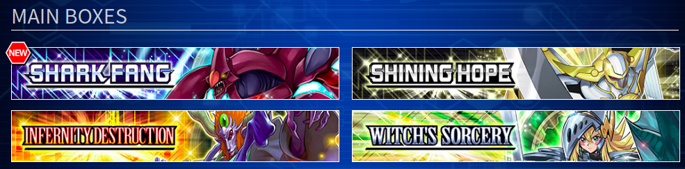
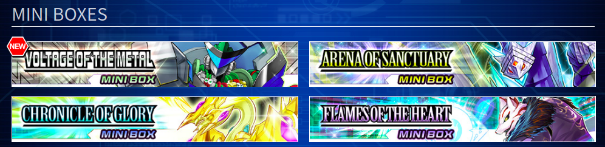
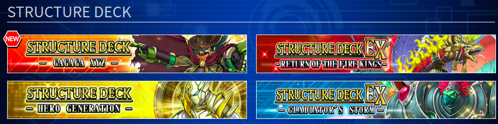

# Duel Links Box Scrapper

<div align="center">
  	
</div>

## **In this project you can get all the cards from a selected box and then send it to your email.**

why?, this is another test, I just wanna try some other libraries from npm and build something.

<div align="center" style="margin: 2em 0 2em 0">
    
    
    
</div>

## 1. Build with

```
puppeteer, nodemailer, typescript
```

<div style="margin: 4em 0 2em 0">

## 2. How to start the Project

</div>

### What you need

```
node.js, typescript.
```

### Clone repository

```
$ git clone git@github.com:falsepopsky/puppeteer-nodemailer-sample.git
```

### Install the project and run

```
# install dependencies
npm install

# run the project
1. npm run build
2. npm run start

or with typescript just type: npm run dev
```

<div style="margin: 4em 0 2em 0">

## 3. Folder Structure

</div>

    .
    ├── build                   # To run the project in production mode
    ├── docs                    # Documentation files
    ├── src                     # Source files
    │   └── services
    │       ├── nodemailer      # Send the scrapped data to our email.
    │       └── puppeteer       # Scrapper function.
    ├── index.ts                # To run the project in dev mode
    └── README.md

<div style="margin: 4em 0 2em 0">
